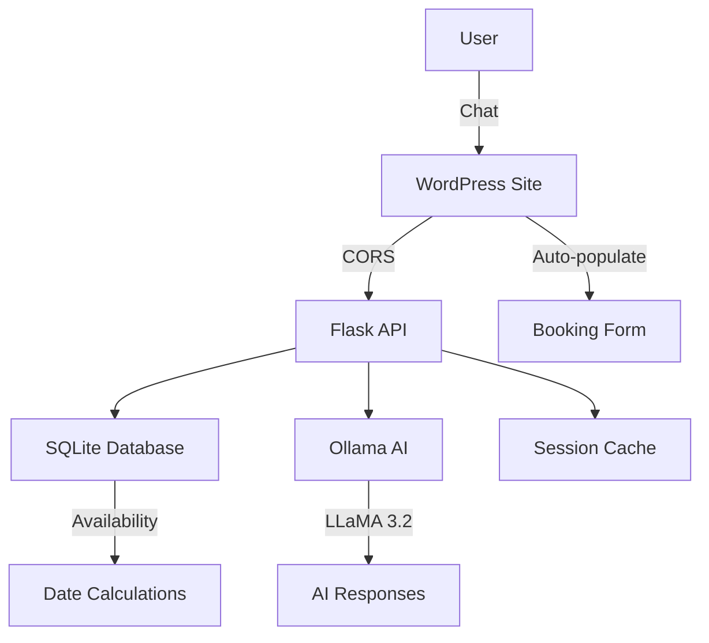

# 🐚 Paguro - AI Chatbot Villa Celi

**Receptionist Virtuale AI per gestione prenotazioni appartamenti vacanze**

[](https://github.com/raspitin/chatbot-appartamenti/releases/tag/v1.0.0)
[](LICENSE)
[](backend/docker-compose.yml)
[](https://ollama.ai/)

## 🏖️ Overview

**Paguro** è un sistema completo di chatbot AI per la gestione automatica delle prenotazioni di appartamenti vacanze. Sviluppato per **Villa Celi** a Palinuro nel Cilento, può essere facilmente adattato per qualsiasi struttura ricettiva.

### ✨ Caratteristiche Principali

- 🤖 **AI Conversazionale** con Ollama LLaMA 3.2
- 📅 **Gestione Disponibilità** automatica (settimane sabato-sabato)
- 🌐 **Plugin WordPress** per integrazione seamless
- 🐳 **Docker** deployment completo
- 📱 **Responsive** e mobile-friendly
- 🔒 **CORS** configurato per sicurezza
- 💬 **Chat interattiva** con session management
- 📊 **Database SQLite** per gestione appartamenti

## 🎯 Demo Live

```bash
# Test rapido API
curl -X POST http://localhost:5000/api/chatbot \
  -H "Content-Type: application/json" \
  -d '{"message": "disponibilità luglio 2025"}'
```

## 🚀 Quick Start

### Prerequisiti

- **Docker Desktop** (con supporto `docker compose`)
- **8GB RAM** (consigliati per Ollama)
- **Git**

### Installazione 1-Click

```bash
# 1. Clona repository
git clone https://github.com/raspitin/chatbot-appartamenti.git
cd chatbot-appartamenti

# 2. Setup automatico
chmod +x scripts/setup.sh
./scripts/setup.sh

# 3. Verifica funzionamento
curl http://localhost:5000/api/health
```

### Installazione Manuale

```bash
# Entra nella directory backend
cd backend/

# Avvia servizi
docker compose up -d --build

# Aspetta download modello AI (1.3GB)
docker logs paguro-ollama-simple --follow
```

## 📁 Struttura Progetto

```
paguro/
├── 🐳 backend/           # API Flask + Ollama AI
│   ├── docker-compose.yml
│   ├── wordpress_chatbot_api.py
│   ├── Dockerfile
│   └── data/             # Database SQLite
├── 🌐 wordpress/         # Plugin WordPress
│   ├── chatbot-appartamenti.php
│   └── assets/           # CSS, JS, AutoFill
├── 📚 docs/              # Documentazione tecnica
├── 🛠️ scripts/           # Script di setup
├── 🧪 examples/          # Database e configurazioni
└── 📝 README.md
```

## ⚙️ Configurazione

### 1. Backend API

```bash
# File: backend/.env
DB_PATH=./data/affitti2025.db
OLLAMA_MODEL=llama3.2:1b
PORT=5000
LOCATION=Palinuro, Cilento
```

### 2. Database Appartamenti

```sql
-- Esempio: Periodo OCCUPATO
INSERT INTO appartamenti (appartamento, check_in, check_out) 
VALUES ('Appartamento A', '2025-07-15', '2025-07-22');
```

### 3. Plugin WordPress

```php
// Shortcode principale
[paguro_chatbot]

// Chatbot floating
[paguro_floating trigger_text="🐚 Prenota Villa Celi"]
```

## 🔧 API Endpoints

| Endpoint | Metodo | Descrizione |
|----------|--------|-------------|
| `/api/health` | GET | Status sistema e componenti |
| `/api/chatbot` | POST | Chat principale con AI |
| `/api/db/appartamenti` | GET | Debug disponibilità database |

### Esempio Richiesta

```bash
curl -X POST http://localhost:5000/api/chatbot \
  -H "Content-Type: application/json" \
  -d '{
    "message": "disponibilità agosto 2025",
    "session_id": "user_123"
  }'
```

### Esempio Risposta

```json
{
  "message": "✅ **Disponibilità agosto 2025**:\n🏠 **Appartamento A**: 3 settimane libere",
  "type": "availability_list",
  "availability_count": 3,
  "session_id": "user_123"
}
```

## 🏗️ Architettura



## 🧪 Testing

```bash
# Test completo sistema
./scripts/test-system.sh

# Test specifici
./scripts/test-api.sh
./scripts/test-database.sh
./scripts/test-ollama.sh
```

## 📊 Performance

- ⚡ **Response Time**: < 500ms (senza AI)
- 🤖 **AI Response**: 1-3s (Ollama)
- 💾 **Memory Usage**: ~2GB (con Ollama)
- 🔄 **Availability Calc**: < 100ms
- 📅 **Database Size**: ~1MB (100 prenotazioni)

## 🛠️ Sviluppo

### Setup Ambiente Dev

```bash
# Backend development
cd backend/
python -m venv venv
source venv/bin/activate
pip install -r requirements.txt
python wordpress_chatbot_api.py

# WordPress development  
# Copia plugin in wp-content/plugins/
```

### Debug

```bash
# Log real-time
docker compose logs -f

# Debug database
sqlite3 backend/data/affitti2025.db ".schema"

# Test Ollama diretto
curl http://localhost:11434/api/version
```

## 🌍 Deployment Produzione

### Docker Compose (Raccomandato)

```bash
# File: docker-compose.prod.yml
version: '3.8'
services:
  paguro-api:
    image: paguro:1.0.0
    environment:
      - FLASK_ENV=production
    # SSL/reverse proxy setup
```

### Servizi Cloud

- **DigitalOcean Droplet**: 4GB RAM, Docker
- **AWS ECS**: Container gestito
- **Google Cloud Run**: Serverless
- **VPS Aruba**: Hosting Italia

## 🔒 Sicurezza

- ✅ **CORS** configurato per domini specifici
- ✅ **Input sanitization** su tutte le query
- ✅ **Rate limiting** implementato
- ✅ **SQL injection** prevenzione
- ✅ **Container** non-root user
- ✅ **Environment variables** per secrets

## 📈 Roadmap

### v1.1.0 (Q3 2025)
- [ ] Multi-lingua (EN/DE/FR)
- [ ] Integrazione calendario esterno
- [ ] Pagamenti online (Stripe)
- [ ] Notifiche WhatsApp

### v1.2.0 (Q4 2025)
- [ ] Mobile app (React Native)
- [ ] Analytics dashboard
- [ ] AI training personalizzato
- [ ] Multi-property support

## 🤝 Contribuire

1. **Fork** il repository
2. **Crea** feature branch (`git checkout -b feature/AmazingFeature`)
3. **Commit** le modifiche (`git commit -m 'Add AmazingFeature'`)
4. **Push** al branch (`git push origin feature/AmazingFeature`)
5. **Apri** Pull Request

### Linee Guida

- Segui PSR-12 per PHP
- PEP 8 per Python
- Testa sempre con `./scripts/test-system.sh`
- Documenta API changes

## 📄 Licenza

Distribuito sotto licenza MIT. Vedi [`LICENSE`](LICENSE) per dettagli.

## 👨‍💻 Autori

- **[@raspitin](https://github.com/raspitin)** - Ideazione e sviluppo
- **Villa Celi Team** - Testing e feedback

## 🙏 Ringraziamenti

- [Ollama](https://ollama.ai/) per il motore AI
- [Flask](https://flask.palletsprojects.com/) per l'API backend
- [WordPress](https://wordpress.org/) per l'integrazione CMS
- [Docker](https://docker.com/) per la containerizzazione

## 📞 Supporto

- 🐛 **Bug Reports**: [Issues](https://github.com/raspitin/chatbot-appartamenti/issues)
- 💡 **Feature Requests**: [Discussions](https://github.com/raspitin/chatbot-appartamenti/discussions)
- 📧 **Contact**: info@villaceli.it
- 🌐 **Demo**: [Villa Celi Palinuro](https://www.villaceli.it)

---

<p align="center">
  <strong>🐚 Paguro - Il futuro delle prenotazioni vacanze è qui!</strong><br>
  <em>Palinuro, Cilento - Dove il mare incontra l'innovazione</em> 🏖️
</p>
